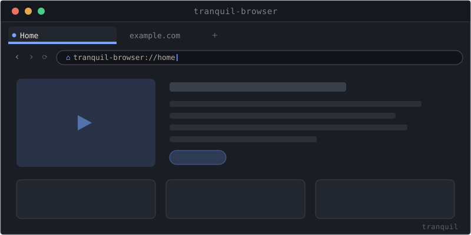
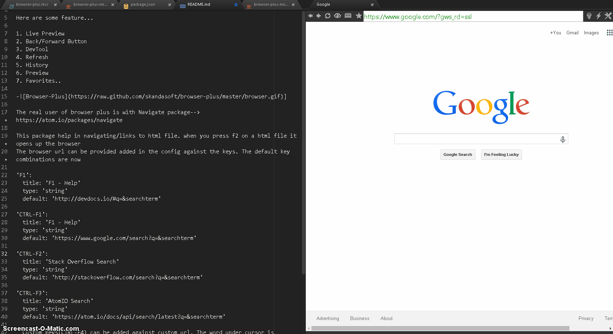

# Tranquil Browser

**The embedded Chromium browser inside [Tranquil Studio](https://github.com/tranquillabs/tranquil-client) — your window onto any web app.**

---

> Part of the Tranquil toolkit, in early developer preview — see the [main repo](https://github.com/tranquillabs/tranquil-client) for status.

## What it is

`tranquil-browser` opens real websites as first-class, splittable **editor tabs** inside Tranquil
Studio — a full Chromium browser, not a preview pane. It's an owned package, bundled with Studio.

## Features

- **Real sites as tabs** — URL bar, history, zoom, DevTools.
- **Branded start page** with a clock and smart search.
- **Find in page** (⌘F) and a configurable **User-Agent** (Chrome/Firefox/Edge/Safari presets).
- **Popups & `_blank` links open as tabs**, not OS windows; hover-link URL preview.
- **Local URLs** — save any tab as a `.url` file (⌘S / drag to the Project Pane); reopen `.url` files.
- **HAR capture & offline replay** — snapshot a page and reopen it offline.

## Install

Bundled with Tranquil Studio. To run the whole thing from source, follow the
[Local Dev Setup runbook](https://tranquillabs.dev/docs/v0.1.0/development/local-dev-setup).

## See it in action

## License

[MIT](LICENSE.md) © Tranquil Labs. Derived from the Atom `browser-plus` package; original
copyright retained in [LICENSE.md](LICENSE.md).
